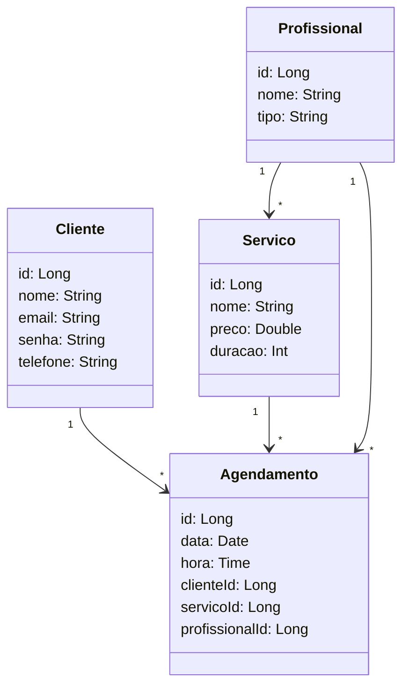

# Software de Agendamentos para Salão de Beleza

## 📌 Status do Projeto
**Em desenvolvimento**

---

## 🛠 Tecnologias Utilizadas
- **Frontend**:
  - HTML5
  - CSS3 (com a biblioteca **Bootstrap**)
  - JavaScript
- **Backend**:
  - Java (Spring Boot)
  - API RESTful
- **Banco de Dados**:
  - MySQL

---

## 👨‍💻 Time de Desenvolvedores
- **Diego Barcellos** - Desenvolvedor Full Stack

---

## 🎯 Objetivo do Software
O sistema visa facilitar o agendamento de serviços em salões de beleza, oferecendo uma plataforma intuitiva e eficiente para clientes realizarem suas reservas de horários, escolherem profissionais e conhecerem mais sobre os serviços disponíveis.

---

## 🚀 Funcionalidades do Sistema
- **Serviço de Login**:
  - Autenticação de usuários para acesso ao sistema.
  - Permite que os clientes criem e acessem suas contas.

- **Serviço de Agendamento**:
  - Agendamento de horários para diferentes serviços oferecidos pelo salão.
  - Escolha do profissional preferido (cabeleireiros, manicures, designers de sobrancelhas).
  - Consideração do tempo estimado de duração de cada serviço no momento do agendamento.

- **Landing Page**:
  - Apresentação dos serviços prestados pelo salão.
  - Informações gerais sobre os profissionais e o funcionamento do salão.

- **Seleção de Profissionais**:
  - Visualização de opções disponíveis para cada serviço.
  - Escolha do profissional desejado pelo cliente.

---

## 📊 Diagrama de Classes

## 📅 Planejamento do Desenvolvimento
- Criação da estrutura inicial do banco de dados.
- Desenvolvimento da API para gerenciamento de login e agendamentos.
- Implementação do frontend com Bootstrap para um design responsivo.
- Integração do frontend com o backend via API REST.
- Testes e ajustes para otimização da experiência do usuário.
